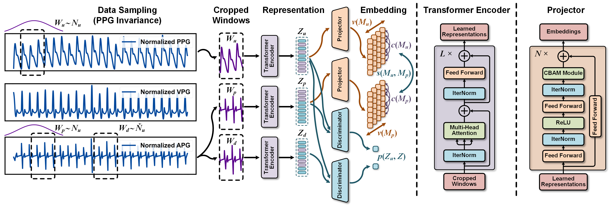

# SMART-BP: Sem-Resnet and Auto-Regressor Based on a Two-Stage Framework for Noninvasive Blood Pressure Measurement
#### *by: Chenbin Ma, Yangyang Sun, Peng Zhang, Fan Song, Youdan Feng, Yufang He, GuangLei Zhang*


## Supplementary Material and code for **SMART-BP**
## Updated experimental results will be released soon!

<p align="center">

</p>

## Datasets
### Available Datasets
We used public MIMIC-III and CAS-BP dataset and our collected private Mindray dataset in this study.
- [MIMIC dataset](https://physionet.org/content/mimic3wdb-matched/1.0/)  
- [CAS-BP dataset](https://github.com/zdzdliu/CAS-BP) 
- [Aurora-BP dataset (Results will be publicized after approval by Microsoft's reviewers)](https://pubmed.ncbi.nlm.nih.gov/35201992/) 

## Implementation Code
### Requirmenets:
- Python==2.7
- Pytorch==0.4.1
- TorchVision==0.2.1
- CUDA==9.0  
- Numpy==1.16.5
- Scipy==1.3.1
- Pandas==0.23.4
- skorch (For DEV risk calculations)
- openpyxl (for BP estimation reports)
- Wandb (for sweeps)
### More detailed notes will be released soon!
### Adding New Dataset
#### Structure of data
To add new dataset (*e.g.,* NewData), it should be placed in a folder named: NewData in the datasets directory.

Since "NewData" has several domains, each domain should be split into train/test splits with naming style as
"train_i_*x*.pt" and "test_i_*x*.pt" for each *i-th* fold.

The structure of data files should in dictionary form as follows:
`train.pt = {"samples": data, "labels: labels}`, and similarly for `test.pt`.

#### Configurations
Next, you have to add a class with the name NewData in the `configs/data_model_configs.py` file. 
You can find similar parameter settings for existing datasets as guidelines. 
Also, you have to specify the cross-domain scenarios in `self.scenarios` variable.

Last, you have to add another class with the name NewData in the `configs/hparams.py` file to specify
the training parameters.


### Existing Algorithms
#### Architectures
- [GRU](https://arxiv.org/abs/1412.3555)
- [ResNet](https://arxiv.org/abs/1611.06455)
- [TCN](https://arxiv.org/abs/1803.01271)
- [Inception](https://arxiv.org/abs/1909.04939)
- [Xception](https://arxiv.org/abs/1911.03803)
- [mWDN](https://arxiv.org/abs/1806.08946)
- [GRU-FCN](https://arxiv.org/abs/1812.07683)
- [Transformer](https://arxiv.org/abs/1706.03762)
#### Regressors
- [KNN](https://scikit-learn.org/stable/modules/generated/sklearn.neighbors.KNeighborsClassifier.html)
- [SVR](http://scikit-learn.org/stable/modules/generated/sklearn.svm.SVR.html)
- [RF](https://scikit-learn.org/stable/modules/generated/sklearn.ensemble.RandomForestClassifier.html)
- [XGBoost](https://xgboost.readthedocs.io/en/stable/)
- [Stacking](https://scikit-learn.org/stable/modules/generated/sklearn.ensemble.StackingClassifier.html)
- [MLP](http://scikit-learn.org/stable/modules/generated/sklearn.neural_network.MLPClassifier.html)


### Adding New Algorithm
To add a new Architectures or Regressors, place it in `algorithms/algorithms.py` file.

## Training procedure

The experiments are organised in a hierarchical way such that:
- Several experiments are collected under one directory assigned by `--experiment_description`.
- Each experiment could have different trials, each is specified by `--run_description`.
- For example, if we want to experiment different *BP estimation* methods with CNN backbone and MLP regressor, we can assign
`--experiment_description CNN_backnones --run_description UPR-BP` and `--experiment_description CNN_backnones --reg MLP --run_description UPR-BP` and so on.

### Training a model

Unsupervised Pretraining:

```
python main.py  --experiment_description exp1  \
                --run_description run_1 \
                --da_method CNN \
                --dataset MIMIC \
                --backbone CNN \
                --num_runs 5 \
                --mode train \
                --is_sweep False
```

Linear Evaluation:

```
python main.py  --experiment_description exp1  \
                --run_description run_1 \
                --da_method CNN \
                --dataset MIMIC \
                --backbone CNN \
                --mode linear \
                --is_sweep False
```
Semi-supervised Evaluation:

```
python main.py  --experiment_description exp1  \
                --run_description run_1 \
                --da_method CNN \
                --dataset MIMIC \
                --backbone CNN \
                --mode semi-supervised \
                --is_sweep False
```
### Launching a sweep
Sweeps here are deployed on [Wandb](https://wandb.ai/), which makes it easier for visualization, following the training progress, organizing sweeps, and collecting results.

```
python main.py  --experiment_description exp1_sweep  \
                --run_description sweep_over_lr \
                --da_method ResNet \
                --dataset MIMIC \
                --backbone CNN \
                --num_runs 200 \
                --is_sweep True \
                --num_sweeps 50 \
                --sweep_project_wandb TEST
```
Upon the run, you will find the running progress in the specified project page in wandb.

`Note:` If you got cuda out of memory error during testing, this is probably due to DEV risk calculations.


## Results
- Each run will have all the cross-domain scenarios results in the format `PPG_to_BP_run_i`, where `i`
is the run_id (you can have multiple runs by assigning `--num_runs` arg). 
- Under each directory, you will find the BP estimation report, a log file, checkpoint, 
and the different risks scores.
- By the end of the all the runs, you will find the overall average and std results in the run directory.


## Citation
If you found this work useful for you, please consider citing it.
```
@article{UPR-BP,
  title   = {UPR-BP: Unsupervised Photoplethysmography Representation Learning for Noninvasive Blood Pressure Estimation},
  author  = {Chenbin Ma, Peng Zhang, Fan Song, Zeyu Liu, Youdan Feng, Yufang He, GuangLei Zhang},
  journal = {####},
  year    = {2023}
}
```

## Contact
For any issues/questions regarding the paper or reproducing the results, please contact any of the following.   

Chenbin Ma:  *machenbin@buaa.edu.cn*

Department of Biomedical Engineering, Beihang University, 
37 Xueyuan Road, Beijing, 100853
