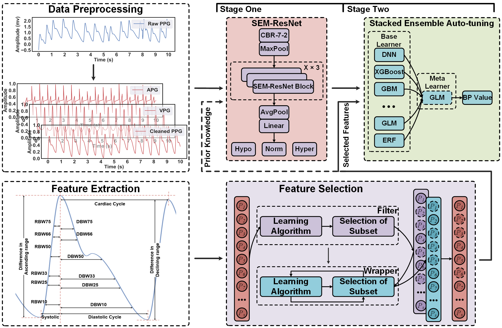

# SMART-BP: Sem-Resnet and Auto-Regressor Based on a Two-Stage Framework for Noninvasive Blood Pressure Measurement
#### *by: Chenbin Ma, Yangyang Sun, Peng Zhang, Fan Song, Youdan Feng, Yufang He, GuangLei Zhang*


## Supplementary Material and code for **SMART-BP**
## Updated experimental results will be released soon!

<p align="center">

</p>

## Datasets
### Available Datasets
We used public MIMIC-III and CAS-BP dataset and our collected private Mindray dataset in this study.
- [MIMIC III waveform dataset](https://physionet.org/content/mimic3wdb-matched/1.0/)  
- [MIndray dataset]()

## Implementation Code
### Requirmenets:
- Python==2.7
- Pytorch==0.4.1
- CUDA==9.0
- Scikit-learn==0.23.2
- Numpy==1.16.5
- Imbalanced-learn==1.7.0
- Scipy==1.3.1
- Pandas==0.23.4
- Matplotlib==3.3.2

### More detailed notes will be released soon!
### Adding New Dataset
#### Structure of data
To add new dataset (*e.g.,* NewData), it should be placed in a folder named: NewData in the datasets directory.

Since "NewData" has several domains, each domain should be split into train/test splits with naming style as
"train_i_*x*.pt" and "test_i_*x*.pt" for each *i-th* fold.

The structure of data files should in dictionary form as follows:
`train.pt = {"samples": data, "labels: labels}`, and similarly for `test.pt`.

#### Configurations
Next, you have to add a class with the name NewData in the `configs/data_model_configs.py` file. 
You can find similar parameter settings for existing datasets as guidelines. 
Also, you have to specify the cross-domain scenarios in `self.scenarios` variable.

Last, you have to add another class with the name NewData in the `configs/hparams.py` file to specify
the training parameters.


### Existing Algorithms
#### Architectures
- [SEM-ResNet]()
- [GRU](https://arxiv.org/abs/1412.3555)
- [ResNet](https://arxiv.org/abs/1611.06455)
- [TCN](https://arxiv.org/abs/1803.01271)
- [Inception](https://arxiv.org/abs/1909.04939)
- [Xception](https://arxiv.org/abs/1911.03803)
- [mWDN](https://arxiv.org/abs/1806.08946)
- [GRU-FCN](https://arxiv.org/abs/1812.07683)
- [Transformer](https://arxiv.org/abs/1706.03762)
#### Regressors
- [AutoML](https://docs.h2o.ai/h2o/latest-stable/h2o-docs/automl.html)
- [KNN](https://scikit-learn.org/stable/modules/generated/sklearn.neighbors.KNeighborsClassifier.html)
- [SVR](http://scikit-learn.org/stable/modules/generated/sklearn.svm.SVR.html)
- [RF](https://scikit-learn.org/stable/modules/generated/sklearn.ensemble.RandomForestClassifier.html)
- [XGBoost](https://xgboost.readthedocs.io/en/stable/)
- [Stacking](https://scikit-learn.org/stable/modules/generated/sklearn.ensemble.StackingClassifier.html)
- [MLP](http://scikit-learn.org/stable/modules/generated/sklearn.neural_network.MLPClassifier.html)
#### Two-Stage
- [SMART-BP]()


### Adding New Algorithm
- To add a new Regressor, place it in `algorithms/algorithms.py` file.
- To add a new Architecture, place it in `models/arch.py` file.

## Experiments procedure

The experiments are organised in a hierarchical way such that:
- Several filters are collected under one directory assigned by `--filters`.
- Several segmentation methods are collected under one directory assigned by `--segments`.
- Several feature extraction methods are collected under one directory assigned by `--feat_extrat`.
- Several visualization methods are collected under one directory assigned by `--visualization`.

### Training a model

For BP interval classification:

```
python trainers/train.py  --experiment_description cls  \
                --run_description run_1 \
                --da_method SEM-ResNet \
                --dataset MIMIC \
                --backbone resnet \
                --num_runs 200 \
                --mode train
```

For BP values estimation:

```
python trainers/train.py  --experiment_description reg  \
                --run_description run_2 \
                --da_method AutoML \
                --dataset MIMIC \
                --backbone XGBoost \
                --mode train
```

### Inference Process

```
python cascade.py
```

## View high-quality images of the paper

```
import os
from PIL import Image

def view_images_in_folder(folder_path):
    # Get a list of all files in the folder
    file_list = os.listdir(folder_path)

    # Iterate over the files
    for filename in file_list:
        # Check if the file is an image (supports more formats than just .jpg)
        if filename.endswith(".jpg") or filename.endswith(".png") or filename.endswith(".jpeg"):
            # Construct the full file path
            file_path = os.path.join(folder_path, filename)

            try:
                # Open and display the image using Pillow
                img = Image.open(file_path)
                img.show()
            except Exception as e:
                print(f"Error opening {file_path}: {e}")

# Provide the folder path to view the images
folder_path = "./misc"
view_images_in_folder(folder_path)
```

## Citation
If you found this work useful for you, please consider citing it.
```
@article{SMART-BP,
  title   = {SMART-BP: Sem-Resnet and Auto-Regressor Based on a Two-Stage Framework for Noninvasive Blood Pressure Measurement},
  author  = {Chenbin Ma, Yangyang Sun, Peng Zhang, Fan Song, Youdan Feng, Yufang He, GuangLei Zhang},
  journal = {####},
  year    = {2023}
}
```

## Contact
For any issues/questions regarding the paper or reproducing the results, please contact any of the following.   

Chenbin Ma:  *machenbin@buaa.edu.cn*

Department of Biomedical Engineering, Beihang University, 
37 Xueyuan Road, Beijing, 100853
